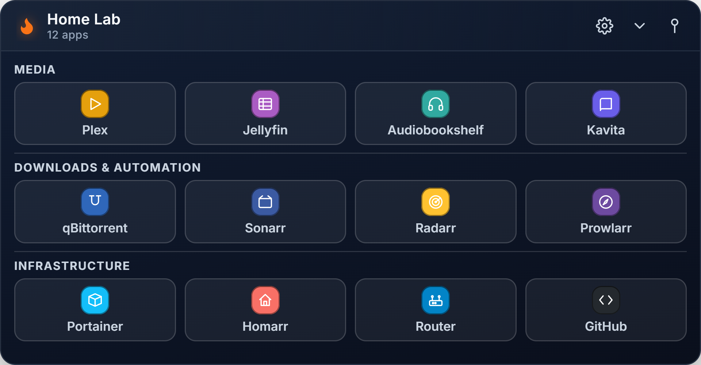
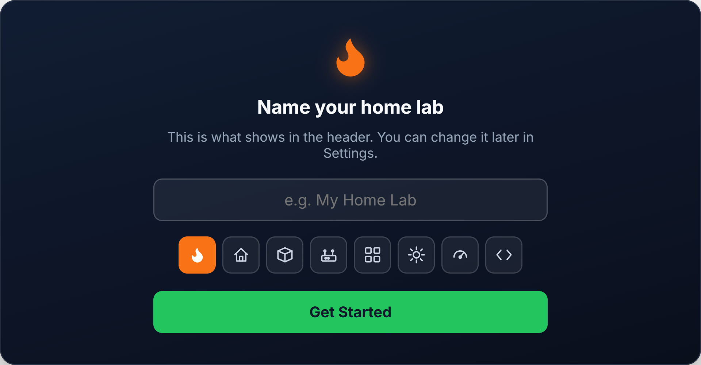
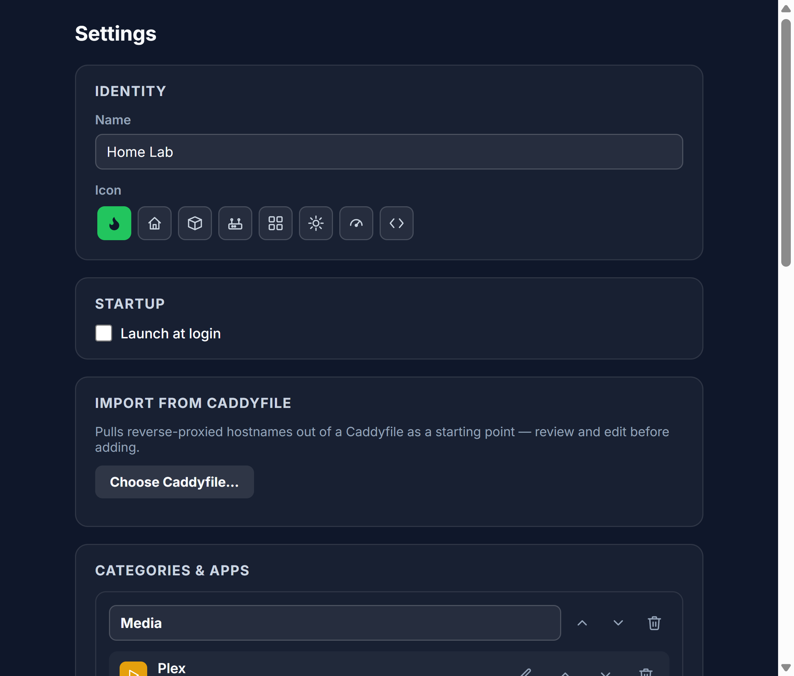
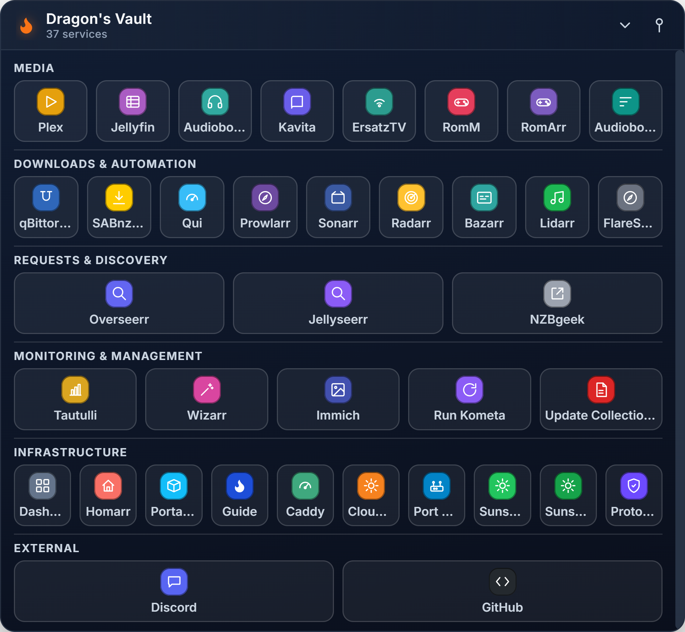

# Home Lab Launcher

A little always-on-top desktop widget that docks in the corner of your screen and gives you one-click buttons to everything you actually use — your home lab dashboard, self-hosted apps, random local scripts, whatever. Not just for home labs either — it's really just a way to organize your desktop into something you can collapse to a pill and get out of the way when you don't need it.



## What it does

- Docks top-right, sizes itself to fit whatever you add — no scrolling.
- Drag it wherever you want. Collapse it to a small pill, expand it back.
- Group your stuff into categories (Media, Downloads, Infra, whatever makes sense to you).
- Tiles can be a URL (opens in your browser) or a local file/shortcut/script (`.lnk`, `.bat`, `.sh`, whatever your OS runs).
- **Pull tiles straight out of a Caddyfile** if you're running Caddy as a reverse proxy — it reads the site blocks, guesses icons for common self-hosted apps, and gives you an editable checklist before adding anything.
- **Pull in your installed games** the same way — point it at a Steam folder (auto-detected if it's in the default location) and it reads the real names via Steam's own manifest files. Point it at anything else (Epic, GOG, Battle.net, Ubisoft, or just a folder of game folders) and it does a best-effort scan for the right `.exe` per folder. Same editable checklist either way.
- Everything's editable through a real settings window — no config files to hand-edit unless you want to.
- Click a tile, it opens the thing and auto-collapses back to the pill.
- Survives crashes without locking you out of your own screen (see below).



Name it whatever you want on first launch. It's your desktop.

## Settings

Add/edit/reorder categories and apps, pick from a built-in icon set, pick a color, toggle "launch at login," import from a Caddyfile. No JSON editing required.



## What it looks like fully set up

This is a real one (37 apps, categories, local shortcuts mixed with web links) — not a mockup:



## Getting started

There's no packaged installer yet — this runs from source for now:

```
git clone <this repo>
cd home-lab-launcher
npm install
npm start
```

Needs [Node.js](https://nodejs.org/). First launch asks you to name your setup, then you're in. Add apps by hand through Settings, or import from a Caddyfile if you've got one.

**Windows, until there's a real installer**: make a shortcut once so you don't need a terminal to relaunch it —

```powershell
$exe = "$PWD\node_modules\electron\dist\electron.exe"
$sc = (New-Object -ComObject WScript.Shell).CreateShortcut("$env:USERPROFILE\Desktop\Home Lab Launcher.lnk")
$sc.TargetPath = $exe
$sc.Arguments = "`"$PWD`""
$sc.WorkingDirectory = "$PWD"
$sc.Save()
```

That gives you a desktop icon, and it'll show up in the Start Menu search too — right-click it there to pin to the taskbar.

## Closing it without losing it

Three ways to back off, from least to most final:

- **Pin button** — just drops always-on-top. Window stays open, it just stops floating above everything else.
- **Quit button** (header) — actually closes it. No hunting through a tray icon.
- **Tray icon** — Show/Hide (keeps running in the background, restores instantly) if you want it out of sight without fully quitting.

There's also a panic hotkey, `Ctrl+Alt+Shift+D`, that un-pins and hides it from anywhere — and the same thing kicks in automatically if the window ever stops responding (renderer crash, GPU hang, whatever). Point is: an always-on-top widget with no way back is a bad time, so there's always a way back.

## Running more than one at once

Launch with `--profile=NAME` and you get a fully independent instance — its own config file, own window, own name/icon. Doesn't conflict with a plain launch or with other profiles; launching the *same* profile twice just focuses the existing one instead of duplicating it.

```
electron . --profile=Work
electron . --profile=Games
```

To make each one a real shortcut, copy the desktop-shortcut snippet above and add `$sc.Arguments = "\"$PWD\" --profile=Work"` (adjust the name).

## Notes

- Windows autostart and the pin/quit/panic-hotkey behavior are all tested and confirmed working. Linux autostart writes a real `.desktop` file and the rest of the code is cross-platform Electron/web APIs throughout, but it hasn't actually been run on a Linux box yet — should work, not yet verified. macOS is untested too.
- Icons are simple flat SVG glyphs, not real app logos — pick whichever one reads closest.
- Your config lives outside the app folder (OS user-data dir), so updating the app later won't wipe your setup.
- No packaged installer/GitHub Actions build yet — that's next.
